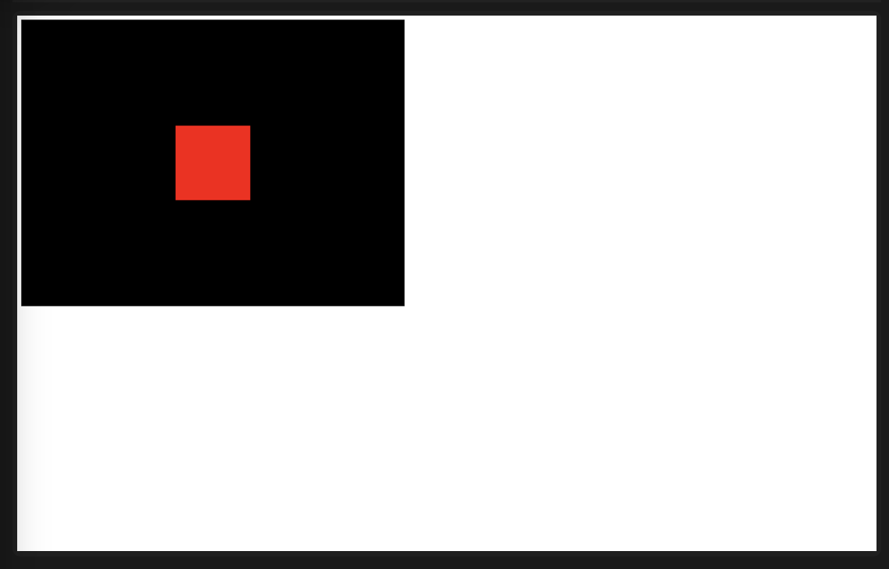

# Threejs_Journey

## Index
- [Lesson 1: Introduction](#lesson-1-introduction)
- [Lesson 2: What is WebGL and Threejs?](#02-what-is-webgl-and-threejs)
- [Lesson 3: Basic Scene](#03-basic-scene)
- [Lesson 4: Local Server](#lesson-4-local-server)
- [Lesson 5: Transform objects](#lesson-5-transform-objects)

## 02. What is WebGL and Threejs?
```
- The goal of Threejs is to decrease the amount of code user have to write to create a 3D website.
```
### Threejs
- A 3D JS library that enables developers to create 3D experiences for the web.
- Work with WebGL, SVG, CSS3D, and HTML5 Canvas.
### WebGL
- A JavaScript API that renders triangles in a canvas. 
- Fast
- Low-level 
<hr>

## 03. Basic Scene
#### First scene
- We need 4 elements to get started:
  - `Scene` 
    - The container of all the objects
    - At some point we ask Three.js to render that scene.
  - `Objects` we can create many types of objects in Threejs
    - Primitive geometries
  - `Camera` 
    - Point of view
    - We can create many types of camera in Threejs
  - `Renderer`
    - Render the scene with the camera

```js
 const scene = new THREE.Scene()

// To create a visible object, we need three things: geometry, material, mesh

// Red cube
const geometry = new THREE.BoxGeometry(1, 1, 1)
// THREE.BoxGeometry(width, height, depth)
const material = new THREE.MeshBasicMaterial({ color: "red" })
const mesh = new THREE.Mesh(geometry, material)

// Follow the order: create geometry, create material, create mesh
scene.add(mesh)

// The aspect ratio is the ratio of the display width divided by the display height.
const sizes = {
    width: 800,
    height: 600
}

// Camera - point of view
const camera = new THREE.PerspectiveCamera(75, sizes.width / sizes.height)
camera.position.z = 3
scene.add(camera)

// Renderer
const canvas = document.querySelector(".webgl") // DOM element
console.log(canvas)
const renderer = new THREE.WebGLRenderer({
    canvas: canvas
})
renderer.setSize(sizes.width, sizes.height)

renderer.render(scene,camera)

```


#### Step by step
1. Create a scene
2. Create a object
   - 

<hr>

### 04. Local Server
#### Problem wth the way we loaded Three.js in the previous lesson
1. Only be able to access to "core" classes.
   - Can't access to class outside of core classes
2. When open HTML file like that, the browser won't let JS execute any instructions
   - Won't be able to load *local files* like textures or models.
   - This actually is for safety reason, you don't want your computer to open an HTML file that you thought was safe.
- But still, we need to be able to run JS code as if it were an online website and to do that, we need to  run  a local server
- **The solution is** using a *build tool* or *bundler*.

##### Build tool
- A build tool is a program that will take all of our JS files and bundle them into one single file.
- We going to use **Vite** today.

##### Vite
- We write web code like HTML, CSS, JS,  and Vite will build the final website for us.
- Vite will do a bunch of other things like optimizations, other languages support, cache breaking, source mapping, running a local server.
- 

#### Node.js
- Node.js is use to running JS on our computer outside of a browser. 
- Node.js is a runtime environment for JS.
  - Use `node -v` to check if Node.js is installed.

#### Dependencies
- Twon dependencies we need to install:
  - Three.js
  - Vite
#### Run the server
``` bash
# Install dependencies (only the first time)
npm install

# Run the local server at localhost:8080
npm run dev

# Build for production in the dist/ directory
npm run build
```

<hr>


### Lesson 3: Transform objects
#### Properties
- There are 4 main properties to transform  objects in our scene:
  - `position`  to move the object
  - `scale` to scale the object
  - `rotation` to rotate the object
  - `quaternion` to rotate the object in a different way

#### The direction of each axis is arbitrary
- x, y, z can be put anywhere we want just not after the `render` function.
  - `x` is going to your right
  - `y` is going up
  - `z` is going toward you 
- The unit of the position is up to the creator depend on what they want to do specifically.
  - In this case, the unit is in meters.

#### Vector3
- `Vector3` is a class that represent a 3D vector.
- `position` inherit from Vector3 which has many useful methods, you can get the length of a vector.


#### Position
```js
// Way to position object
// Move object
mesh.position.x = 0.7;
mesh.position.y = -0.6;
mesh.position.z = 1;

// Another way to move object
mesh.position.set(0.7, -0.6, 1); // order is x, y, z
```

##### Vector3
- `Vector3` is a class that represent a 3D vector.
- Some useful methods
```js
// Get the length of a vector
console.log(mesh.position.length());

// Get a distance from another Vector3
console.log(mesh.position.distanceTo(camera.position));

// Normalize its values (mean that you can reduce the length of the vector to 1)
console.log(mesh.position.normalize())
```

#### Scale
```js
// Scale object
mesh.scale.x = 2;
mesh.scale.y = 0.5;
mesh.scale.z = 0.5;

// Another way to scale object
mesh.scale.set(2, 0.5, 0.5); // order is x, y, z
```

#### Rotation
- 
```js
// When we rotate an object, just imagine that we rotate the object around the axis
mesh.rotation.x = Math.PI * 0.25; 
mesh.rotation.y = Math.PI * 0.25;
mesh.rotation.z = Math.PI * 0.25;

```

#### Quaternion
- `quaternion` is a way to rotate an object in a different way.
-  


### Lesson 4: Animations
#### Using requestAnimationFrame
